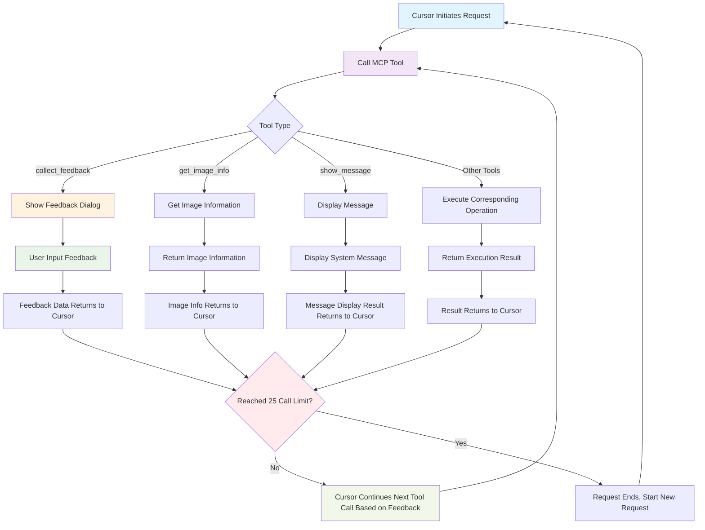

# Cursor Request Max - Maximize Cursor Request Potential

This is a revolutionary VS Code extension specifically designed to **maximize the utilization of Cursor's MCP tool calling capabilities**. Through intelligent interactive feedback mechanisms, it enables Cursor to continuously call MCP tools within a single request, fully leveraging the potential of the 25 tool call limit.

## 🚀 Core Philosophy

Cursor can make up to 25 tool calls in a single request, but traditional usage patterns often fail to fully utilize this limit. This plugin solves this problem through the following innovative mechanisms:

1. **Continuous Interactive Loop**: Obtain user's next instructions within MCP tools
2. **Intelligent Feedback Collection**: Collect user feedback after each tool call to guide subsequent operations
3. **Maximize Tool Utilization**: Fully leverage the 25 call opportunities in a single request

## Usage

1. **Download and Manual Installation**

   Download the latest version from the release page:
   
   
   **Manual Installation Steps:**
   - Download the `.vsix` file
   - In VS Code, press `Ctrl+Shift+P` (Windows/Linux) or `Cmd+Shift+P` (Mac)
   - Type "Extensions: Install from VSIX..."
   - Select the downloaded `.vsix` file
   
   **Or install via command line:**
   ```bash
   code --install-extension cursor-request-max-x.x.x.vsix
   ```

   **Launch the Extension:**
   - Press `Cmd/Ctrl + Shift + P` to open the command palette
   - Type "Cursor Request Max" to start the extension

2. **Initialize Configuration**

   - Initialize `.cursor` rules and MCP configuration

3. **Verify Installation**

   - Open Cursor settings -> MCP, confirm that the MCP server is running

## 🔧 Cursor Usage Prerequisites

Before using this plugin in Cursor, please ensure the following conditions are met:

### 1. Plugin Initialization Success
- Ensure the extension has been successfully initialized
- Check that complete rule configurations exist in the `.cursor` directory
- Verify that the MCP server configuration file has been generated correctly

### 2. MCP Server Connection Normal
- Open Cursor Settings → MCP Configuration page
- Confirm MCP server status is "Connected" or "Running"
- Verify server address is `http://localhost:3100`
- If connection fails, restart the extension or check for port conflicts

### 3. Use Agent Mode
- Open Chat Mode in Cursor
- **Important**: Must switch to **Agent Mode** to call MCP tools
- Start conversations in Agent Mode for AI to access tools like `collect_feedback`, `get_image_info`, etc.

### Verification Steps
1. Enter test command in Cursor: `Please use the collect_feedback tool to collect my feedback`
2. If the tool works normally, a feedback collection dialog will appear
3. If it prompts that tools are unavailable, please check the above prerequisites


## 🎯 Features

### Core Functionality
- 🔄 **Interactive Feedback Loop**: Implement continuous user interaction through the `collect_feedback` tool
- 🖼️ **Image Feedback Support**: Users can provide richer feedback through images
- ⚡ **Real-time Status Sync**: Real-time synchronization between MCP server and VS Code sidebar
- 🎨 **Modern Interface**: Beautiful user interface based on React + Tailwind CSS

### MCP Tool Suite
- `collect_feedback` - Interactive tool for collecting user feedback. AI can report completed work, and users can provide text and/or image feedback
  - Parameters:
    - `work_summary` (string, optional): Report of work completed by AI
    - `timeout_seconds` (number, optional): Dialog timeout in seconds, set to 0 for never timeout, default is 0
- `get_image_info` - Get information about images at specified paths (dimensions, format, etc.)
  - Parameters:
    - `image_path` (string, required): Path to the image file
- `show_message` - Display various messages in VS Code (hidden tool, implemented through call handler)
  - Parameters:
    - `message` (string): Message content to display
    - `type` (string, optional): Message type, can be "info", "warning", "error", default is "info"

## 🔧 How It Works

### Call Flow Diagram




### Maximization Strategy

1. **Intelligent Task Decomposition**: Break complex tasks into multiple small steps
2. **Continuous Feedback Collection**: Collect user feedback after completing each step
3. **Dynamic Direction Adjustment**: Adjust subsequent operations based on user feedback in real-time
4. **Full Limit Utilization**: Ensure all 25 calls are used for valuable operations

## 📦 Installation and Development

### Prerequisites

- Node.js (version 18 or higher)
- VS Code (version 1.75.0 or higher)
- Cursor IDE (with MCP protocol support)

### Development Steps

1. **Clone Project**:
   ```bash
   git clone https://github.com/daodao97/cursor-request-max.git
   cd cursor-request-max
   ```

2. **Install Dependencies**:
   ```bash
   npm install
   ```

3. **Compile Project**:
   ```bash
   npm run compile
   npm run build:react
   ```

4. **Start Debugging**:
   - Press `F5` or use Command Palette to run "Run Extension"
   - This will open a new VS Code window with your extension loaded

### Usage

1. **Auto Start**: The extension automatically starts the MCP server after activation
2. **View Sidebar**: Click the Cursor Request Max icon in the activity bar
3. **Configure Cursor**: Configure MCP server connection in Cursor
4. **Start Using**: Interact with MCP tools through natural language in Cursor

## 🌐 MCP Server Configuration

The MCP server runs on `http://localhost:3100` by default, supporting the following endpoints:

- `GET /` - Server status page
- `POST /sse` - SSE connection endpoint (for MCP communication)
- `GET /health` - Health check endpoint

## 📊 Usage Examples

### Typical 25-Call Scenario

```
1. collect_feedback({work_summary: "Start project analysis"}) → User specifies analysis target
2. show_message({message: "Starting file structure analysis", type: "info"}) → Show progress
3. collect_feedback({work_summary: "File structure analysis complete"}) → User confirms to continue
4. get_image_info({image_path: "/path/to/reference.png"}) → Get reference image information
5. collect_feedback({work_summary: "Adjust plan based on image info"}) → User provides specific requirements
... (Continue 20 more calls)
25. collect_feedback({work_summary: "All tasks completed"}) → Final confirmation
```

## 🏗️ Project Structure

```
cursor-request-max/
├── .vscode/
│   ├── launch.json          # Debug configuration
│   └── tasks.json           # Build tasks
├── src/
│   ├── extension.ts         # VS Code extension main file
│   ├── mcpServer.ts         # MCP server core implementation
│   ├── sidebar.ts           # Sidebar view provider
│   └── react/               # React frontend components
├── out/                     # Compiled output directory
├── assets/                  # Static resources
├── package.json             # Project configuration and dependencies
├── tsconfig.json            # TypeScript configuration
├── vite.config.mjs          # Vite build configuration
└── README.md               # Project documentation
```

## 🛠️ Development Commands

- `npm run compile` - Compile TypeScript
- `npm run watch` - Watch file changes and auto-compile
- `npm run build:react` - Build React frontend
- `npm run dev:react` - Development mode React frontend build

## 🔍 Debugging Instructions

1. Open project in VS Code
2. Press `F5` to start debugging
3. Test extension functionality in the new window
4. Check console output to understand MCP communication status
5. Use `Ctrl+R` / `Cmd+R` to reload the extension

## 🚀 Extension Features

Based on this framework, you can further develop:

- Add more MCP tool types
- Enhance user interaction interface
- Integrate more development tools
- Optimize call strategy algorithms
- Add call statistics and analysis features

## 🤝 Contributing

Welcome to submit Issues and Pull Requests! Please ensure:

1. Follow existing code style
2. Add appropriate tests
3. Update relevant documentation
4. Describe changes in detail

## License

MIT License 

## 图片资源管理

### 全局 `getImageUri` 函数

现在您可以使用全局的 `getImageUri` 函数来方便地获取任何图片资源：

```javascript
// 基本用法
const uri = await window.getImageUri('icon.jpeg');

// 获取头像图片
const aiAvatar = await window.getImageUri('assets/images/avatars/ai.png');
const userAvatar = await window.getImageUri('assets/images/avatars/user.png');

// 获取自定义图片
const customImage = await window.getImageUri('my-custom-folder/image.jpg');
```

### 支持的图片路径

- `icon.jpeg` - 扩展主图标
- `assets/images/logo.png` - Logo图片
- `assets/images/avatars/ai.png` - AI头像
- `assets/images/avatars/user.png` - 用户头像
- `assets/images/avatars/robot.png` - 机器人头像
- `assets/images/avatars/assistant.png` - 助手头像
- 任何相对于扩展根目录的图片文件路径

### 在React组件中使用

```jsx
const MyComponent = () => {
    const [imageUri, setImageUri] = useState(null);
    
    useEffect(() => {
        const loadImage = async () => {
            const uri = await window.getImageUri('assets/images/my-image.png');
            setImageUri(uri);
        };
        loadImage();
    }, []);
    
    return (
         console.log('图片加载失败，将显示fallback')}
        />
    );
};
```

### 预设的图片资源

通过 `window.imageResources` 可以访问预设的图片资源：

```javascript
// 直接使用预设的图片资源
const resources = window.imageResources;
console.log(resources.icon);           // 主图标
console.log(resources.avatars.ai);     // AI头像
console.log(resources.fallbacks.ai);   // AI fallback表情符号
``` 