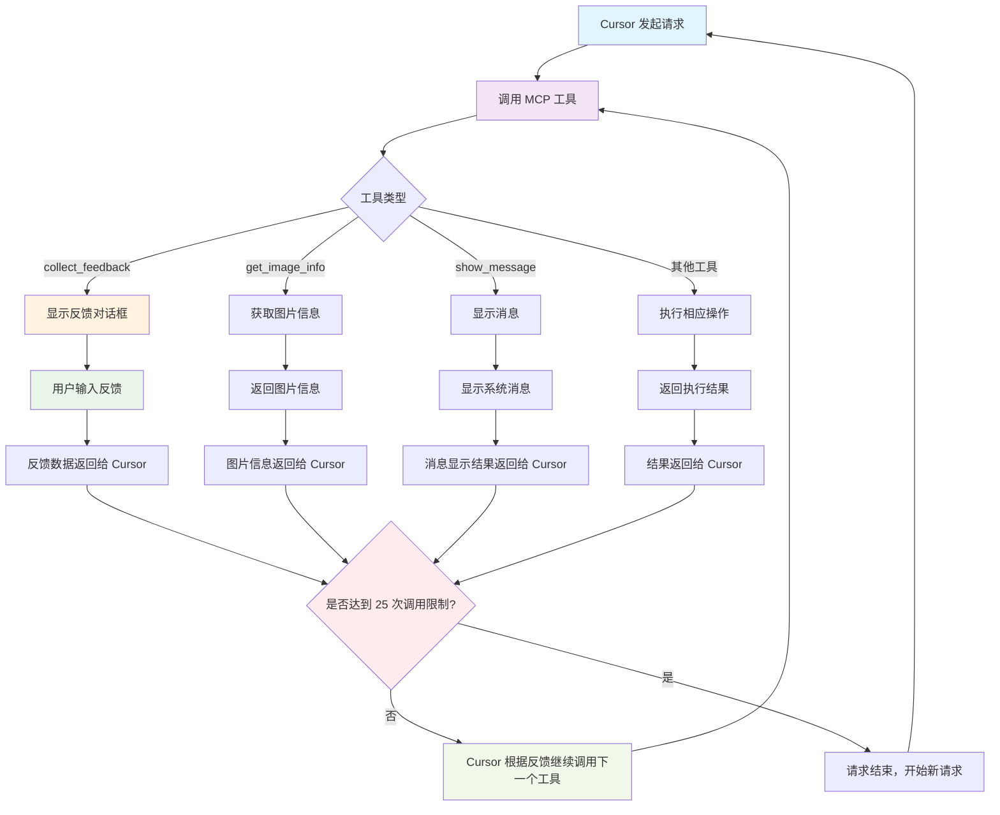

[English](./README.md) | [简体中文](./README_zh.md) | [Follow Me on X](https://x.com/intent/follow?screen_name=daodao97__)

# Cursor Request Max - 最大化 Cursor 请求潜力

这是一个革命性的 Cursor 扩展，专门设计用于**最大化利用 Cursor 的 MCP 工具调用能力**。通过智能的交互式反馈机制，让 Cursor 在单次请求中持续调用 MCP 工具，充分发挥 25 次工具调用限制的潜力。

## 🚀 核心理念

Cursor 在一次请求中最多可以调用 25 次工具，但传统的使用方式往往无法充分利用这个限制。本插件通过以下创新机制解决这个问题：

1. **持续交互循环**: 在 MCP 工具中获取用户的下一步指令
2. **智能反馈收集**: 每次工具调用后收集用户反馈，指导下一步操作
3. **最大化工具利用**: 将单次请求的 25 次调用机会发挥到极致

## 使用安装

1. **下载并手动安装**

   从发布页面下载最新版本：
   
   [release](https://github.com/daodao97/cursor-request-max/release)
   
   **手动安装步骤：**
   - 下载 `.vsix` 文件
   - 在 VS Code 中按 `Ctrl+Shift+P` (Windows/Linux) 或 `Cmd+Shift+P` (Mac)
   - 输入 "Extensions: Install from VSIX..."
   - 选择下载的 `.vsix` 文件
   
   **或使用命令行安装：**
   ```bash
   code --install-extension cursor-request-max-x.x.x.vsix
   ```

   **启动扩展：**
   - 按 `Cmd/Ctrl + Shift + P` 打开命令面板
   - 输入 "Cursor Request Max" 启动扩展

2. **初始化配置**

   - 初始化 `.cursor` 规则和 MCP 配置

3. **验证安装**

   - 打开 Cursor 设置 -> MCP，确认 MCP 服务器正在运行

## 🔧 Cursor 使用先决条件

在 Cursor 中使用本插件之前，请确保满足以下条件：

### 1. 插件初始化成功
- 确保扩展已成功初始化
- 检查 `.cursor` 目录下是否有完整的规则配置
- 验证 MCP 服务器配置文件已正确生成

### 2. MCP 服务器连接正常
- 打开 Cursor 设置 → MCP 配置页面
- 确认 MCP 服务器状态为"已连接"或"运行中"
- 验证服务器地址为 `http://localhost:3100`
- 如果连接失败，请重启扩展或检查端口占用

### 3. 使用 Agent 模式
- 在 Cursor 中打开聊天模式 (Chat Mode)
- **重要**: 必须切换到 **Agent 模式** 才能调用 MCP 工具
- 在 Agent 模式下开始对话，AI 才能访问 `collect_feedback`、`get_image_info` 等工具

### 验证步骤
1. 在 Cursor 中输入测试命令：`请使用 collect_feedback 工具收集我的反馈`
2. 如果工具正常工作，会弹出反馈收集对话框
3. 如果提示工具不可用，请检查上述先决条件


## 🎯 功能特性

### 核心功能
- 🔄 **交互式反馈循环**: 通过 `collect_feedback` 工具实现持续的用户交互
- 🖼️ **图片反馈支持**: 用户可以通过图片提供更丰富的反馈信息
- ⚡ **实时状态同步**: MCP 服务器与 VS Code 侧边栏实时同步状态
- 🎨 **现代化界面**: 基于 React + Tailwind CSS 的美观用户界面

### MCP 工具集
- `collect_feedback` - 收集用户反馈的交互式工具。AI可以汇报完成的工作，用户可以提供文字和/或图片反馈
  - 参数：
    - `work_summary` (string, 可选): AI完成的工作内容汇报
    - `timeout_seconds` (number, 可选): 对话框超时时间（秒），设置为0表示永不超时，默认为0
- `get_image_info` - 获取指定路径图片的信息（尺寸、格式等）
  - 参数：
    - `image_path` (string, 必需): 图片文件路径
- `show_message` - 在 VS Code 中显示各类消息（隐藏工具，通过调用处理器实现）
  - 参数：
    - `message` (string): 要显示的消息内容
    - `type` (string, 可选): 消息类型，可选值为 "info", "warning", "error"，默认为 "info"

## 🔧 工作原理

### 调用流程图



### 最大化利用策略

1. **智能工作分解**: 将复杂任务分解为多个小步骤
2. **持续反馈收集**: 每完成一个步骤就收集用户反馈
3. **动态调整方向**: 根据用户反馈实时调整后续操作
4. **充分利用限制**: 确保 25 次调用都用于有价值的操作

## 📦 安装和开发

### 先决条件

- Node.js (版本 18 或更高)
- VS Code (版本 1.75.0 或更高)
- Cursor IDE (支持 MCP 协议)

### 开发步骤

1. **克隆项目**:
   ```bash
   git clone https://github.com/daodao97/cursor-request-max.git
   cd cursor-request-max
   ```

2. **安装依赖**:
   ```bash
   npm install
   ```

3. **编译项目**:
   ```bash
   npm run compile
   npm run build:react
   ```

4. **启动调试**:
   - 按 `F5` 或使用命令面板运行 "运行扩展"
   - 这将打开一个新的 VS Code 窗口，其中加载了您的扩展

### 使用方法

1. **自动启动**: 扩展激活后会自动启动 MCP 服务器
2. **查看侧边栏**: 在活动栏中点击 Cursor Request Max 图标
3. **配置 Cursor**: 在 Cursor 中配置 MCP 服务器连接
4. **开始使用**: 在 Cursor 中通过自然语言与 MCP 工具交互

## 🌐 MCP 服务器配置

MCP 服务器默认运行在 `http://localhost:3100`，支持以下端点：

- `GET /` - 服务器状态页面
- `POST /sse` - SSE 连接端点（用于 MCP 通信）
- `GET /health` - 健康检查端点

## 📊 使用示例

### 典型的 25 次调用场景

```
1. collect_feedback({work_summary: "开始项目分析"}) → 用户指定分析目标
2. show_message({message: "开始分析文件结构", type: "info"}) → 显示进度
3. collect_feedback({work_summary: "文件结构分析完成"}) → 用户确认继续
4. get_image_info({image_path: "/path/to/reference.png"}) → 获取参考图片信息
5. collect_feedback({work_summary: "根据图片信息调整方案"}) → 用户提供具体要求
... (继续 20 次调用)
25. collect_feedback({work_summary: "所有任务完成"}) → 最终确认
```

## 🏗️ 项目结构

```
cursor-request-max/
├── .vscode/
│   ├── launch.json          # 调试配置
│   └── tasks.json           # 构建任务
├── src/
│   ├── extension.ts         # VS Code 扩展主文件
│   ├── mcpServer.ts         # MCP 服务器核心实现
│   ├── sidebar.ts           # 侧边栏视图提供者
│   └── react/               # React 前端组件
├── out/                     # 编译输出目录
├── assets/                  # 静态资源
├── package.json             # 项目配置和依赖
├── tsconfig.json            # TypeScript 配置
├── vite.config.mjs          # Vite 构建配置
└── README.md               # 项目说明
```

## 🛠️ 开发命令

- `npm run compile` - 编译 TypeScript
- `npm run watch` - 监听文件变化并自动编译
- `npm run build:react` - 构建 React 前端
- `npm run dev:react` - 开发模式构建 React 前端

## 🔍 调试说明

1. 在 VS Code 中打开项目
2. 按 `F5` 启动调试
3. 在新窗口中测试扩展功能
4. 查看控制台输出了解 MCP 通信状态
5. 使用 `Ctrl+R` / `Cmd+R` 重新加载扩展

## 🚀 扩展功能

基于此框架，您可以进一步开发：

- 添加更多 MCP 工具类型
- 增强用户交互界面
- 集成更多开发工具
- 优化调用策略算法
- 添加调用统计和分析功能

## 🤝 贡献指南

欢迎提交 Issue 和 Pull Request！请确保：

1. 遵循现有的代码风格
2. 添加适当的测试
3. 更新相关文档
4. 详细描述变更内容

## 许可证

MIT License 